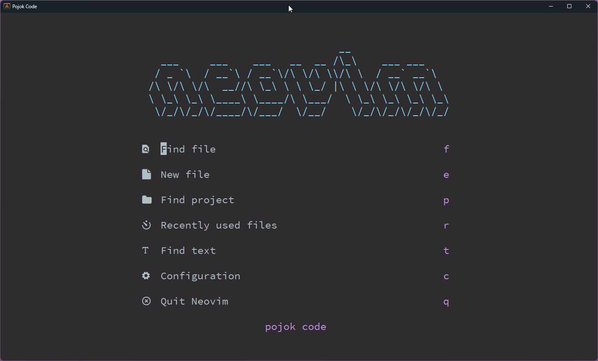

## HOME



## PHP


## JAVA


# Panduan Install Dan Konfigurasi NeoVim

## Kebutuhan Dasar

1. Install Neovim 8.0+ https://github.com/neovim/neovim/releases/tag/v0.8.1
2. C++ (windows) Compiler https://www.msys2.org/
3. GIT https://git-scm.com/download/win
4. NodeJs https://nodejs.org/en/
5. Ripgrep https://github.com/BurntSushi/ripgrep
6. Lazygit https://github.com/jesseduffield/lazygit
7. Nerd Font https://github.com/ryanoasis/nerd-fonts
8. Windows Terminal (Windows) https://apps.microsoft.com/store/detail/windows-terminal/9N0DX20HK701?hl=en-id&gl=id
9. Powershell (windows) https://apps.microsoft.com/store/detail/powershell/9MZ1SNWT0N5D?hl=en-id&gl=id

## Panduan Windows

- Pastikan sudah menginstall kebutuhan dasar diatas
- Jalankan Script Dibawah pada Powershell

```
git clone https://github.com/pojokcodeid/nvim.git "$env:LOCALAPPDATA\nvim"
nvim
```

## Panduan Linux (Debian Based)

1.  Pastikan Acess Administrator

```
visudo
[nama user] ALL=(ALL:ALL) ALL
[nama user] ALL=(ALL) NOPASSWD:ALL
```

2. Install Neovim

```
sudo apt-get install wget
mkdir download
cd download
wget https://github.com/neovim/neovim/releases/download/v0.8.1/nvim-linux64.deb
sudo apt-get install ./nvim-linux64.deb
nvim --version
```

3. Check GCC

```
gcc --version
```

4. Install NodeJS

```
sudo apt-get install curl
sudo apt install build-essential libssl-dev
curl -o- https://raw.githubusercontent.com/nvm-sh/nvm/v0.35.3/install.sh | bash
source ~/.bashrc
nvm install 18.13.0
node --version
npm --version
```

5. Install unzip, ripgrep

```
sudo apt-get install unzip
sudo apt-get install ripgrep
```

6. Install lazygit

```
LAZYGIT_VERSION=$(curl -s "https://api.github.com/repos/jesseduffield/lazygit/releases/latest" | grep '"tag_name":' |  sed -E 's/.*"v*([^"]+)".*/\1/')
curl -Lo lazygit.tar.gz "https://github.com/jesseduffield/lazygit/releases/latest/download/lazygit_${LAZYGIT_VERSION}_Linux_x86_64.tar.gz"
sudo tar xf lazygit.tar.gz -C /usr/local/bin lazygit
lazygit --version
```

7. Install Git

```
sudo apt-get install git
git --version
```

8.  Clone Config

```
git clone https://github.com/pojokcodeid/nvim.git ~/.config/nvim
```

## Seting Bahasa Pemprograman

- https://youtube.com/playlist?list=PLhzwHCJWMbnvhPy0wqZGVBRUEAgS93iuk

## key lazygit

<a href="https://github.com/jesseduffield/lazygit/blob/master/docs/keybindings/Keybindings_en.md?fbclid=IwAR3BogewbYeP0PbPY1pewCkq2c3PKua3eHi-00rHpdSdz9gSKrY71Pv10u4" target="_blank">Key Lazygit</a>

## Terima Kasih

https://github.com/LunarVim/Neovim-from-scratch <br>
https://github.com/AstroNvim/AstroNvim
