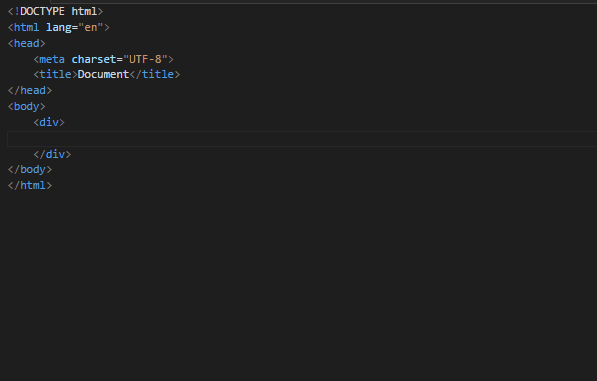

# Font-awesome codes for html (snippets)


## Installation

### Extension Marketplace

Find this plugin in extensions or:
Launch Quick Open, paste the following command, and press Enter

```
ext install font-awesome-codes-html
```

### Clone Repository
Change to your Visual Studio Code extensions directory:
```
# Windows
$ cd %USERPROFILE%\.vscode\extensions

# Linux & macOS
$ cd ~/.vscode/extensions/
```

Clone repository as `font-awesome-codes-html`:
```
$ git clone https://github.com/dslpp056193/font-awesome-codes-html font-awesome-codes-html
```

## Usage

Snippets are limited to the html scope. Typing the class name of an icon using the designated prefix will complete to full and correct name of this icon.

Example:



## License
This work is licensed under [The MIT License](https://opensource.org/licenses/MIT)

## Donate
You can help me and support this project with  [paypal](https://www.paypal.com/cgi-bin/webscr?cmd=_donations&business=MTXAUGWFGFLYW&lc=US&item_name=For%20support%20project&item_number=me&currency_code=USD&bn=PP%2dDonationsBF%3abtn_donateCC_LG%2egif%3aNonHosted) or Bitcoin  `33yhTK5BnKj6MZ3wf4GFEQgCtmWtqNwJHU`